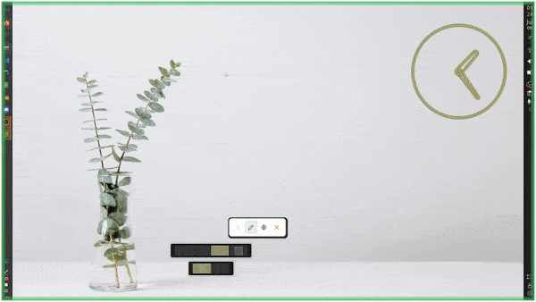

# DrawOnScreen

> DrawOnScreen is a simple universal screen annotation tool.

## Features

- Draw on screen!
- Change color!
- Disappearing strokes!
- Variable stroke width!
- Activate with global shortcut!
- Very cool!

## Installation

// TODO